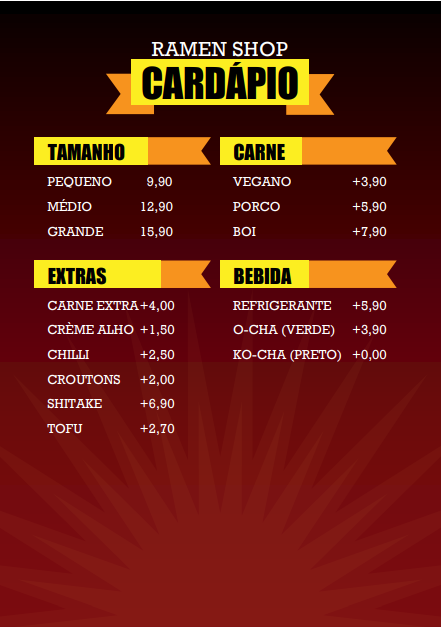

# Trabalho Prático sobre Princípios SOLID e Padrões de Projeto

## 1. Requisitos do trabalho

O objetivo deste trabalho é que os conceitos aprendidos ao longo da disciplina de Programação
Modular sejam aplicados em conjunto em um programa coeso e extensível, que utilize padrões de
projeto.  
- O sistema deve ser desenvolvido em dupla.
- O sistema a ser desenvolvido está detalhado na seção a seguir.
  
### 1.1 O problema

No Japão existe um tipo de restaurante muito comum chamado de Ramen Shop, que é especializado
em vender o macarrão do tipo Lamen, muito conhecido no Brasil pelo seu representante da Nissin, o
Miojo. A Figura 1 exibe a foto do Ichiran Ramen Shop em Osaka, no Japão. A máquina acesa na calçada
exibe o menu onde o cliente escolhe o prato que irá comer. Ele recebe uma senha e irá buscar o prato
quando estiver pronto no restaurante. Você deverá desenvolver um sistema para um Ramen Shop. 
O menu do seu sistema deve seguir a regras apresentada na Figura 2. O cliente escolhe o tamanho do prato,
que possui um preço base. A cada adicional no Combo, o preço vai sendo acrescido. Ao terminar a escolha, o sistema
deve calcular o total e emitir o número do pedido. O pedido então deve ser adicionado a uma listade espera.
Quando um pedido fica pronto, o cliente deve receber a notificação. Após o Cliente marcar
o pedido como retirado, o pedido irá para o balanço final do restaurante. O sistema deve garantir que 
só exista uma única lista de espera no restaurante. Não pode haver listas paralelas.
  

  

### 1.2 Requisitos não funcionais

Esse trabalho usará pelo menos três dos padrões de
projeto: Singleton, Decorator, Factory e Observer. Será avaliada a conformidade com os requisitos, bem como a qualidade do código, 
utilização dos conceitos básicos e avançados de programação modular, tais como Collections, Tratamento de exceções, etc. Não é necessário implementar interface gráfica com o usuário.

O sistema deverá ser projetado utilizando a notação UML. O sistema deverá ser testado com
testes unitários baseados na JUnit.

## 2. Resultados esperados
Deverá ser entregue em um arquivo comprimido em formato .zip, contendo a Documentação e o
código fonte do projeto. O nome do arquivo .zip deve ser a concatenação dos nomes dos integrantes
do grupo.
