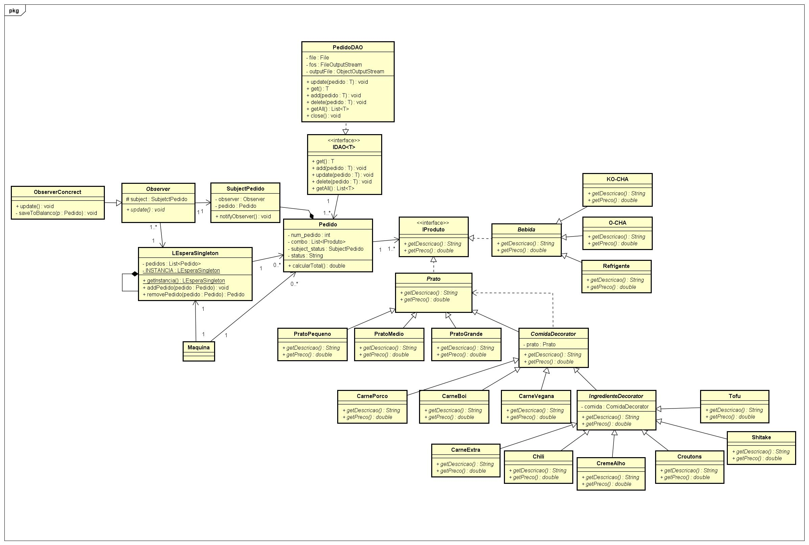

# Sistema Ramen Shop

**Erick Vinicius Oliveira de Paiva, erick.paiva@sga.pucminas.br**

**Rafael Duarte Pereira, rafaelduarte1234.2015@gmail.com**
  

---

_Curso de Engenharia de Software, Unidade Praça da Liberdade_

_Instituto de Informática e Ciências Exatas – Pontifícia Universidade Católica de Minas Gerais (PUC MINAS), Belo Horizonte – MG – Brasil_

---

_**Resumo**. Atualmente, é possível analisar que softwares embarcados são cada vez mais utilizados em estabelecimentos comercias de comida. Assim, os Ramens Shops, restaurantes japoneses de ramen, apesar de eficientes, possuem tal necessidade de modernização. Dessa forma, nesse projeto iremos prover uma solução em código para este problema, através da linguagem de programação Java como back-end da aplicação e do Java Swing como front-end, de modo que irá sanar por vez a carência apontada pelos Ramens Shops._

---

## 1. Introdução

    1.1 Contextualização

Na atualidade, há de se afirmar que, desde o início da Revolução Técnico-Científica, o mundo vem se modernizando cada vez mais. Desse modo, restaurantes, por consequência, também se tornam reféns da modernização, tal como o Mc Donalnads, que em muitos estabelecimentos de sua propriedade possuem máquinas especializadas em realizar pedidos dos clientes de maneira automática, sem a necessidade de um ser humano atendente na intervenção.

    1.2 Problema

À vista disso, o Ramen Shop, um tipo de restaurante muito comum no Japão, há, também, a necessidade de se modernizar, de modo que para a realização dos pedidos de ramens de modo eficaz é fulcral o uso de um software embarcado, como o existente em alguns estabelecimentos do Mc Donalds.

    1.3 Objetivo geral

Para tal possibilidade, é preciso desenvolver um sistema capaz de realizar pedidos a partir de um menu. Além disso, por trás da interface do usuário, o sistema deve obter apenas uma única lista de espera dos pedidos e gerar um balanço geral de todos os pedidos já feitos naquela máquina, para controle do restaurante.

        1.3.1 Objetivos específicos
Portanto, os objetivos específicos desse projeto são:

- Criar menu capaz de realizar pedido automatizado.
- Gerar senha para retirada do pedido pelo cliente.
- Notificar pedido pronto ao cliente.
- Controlar status do pedido por meio de um observador.
- Adicionar pedidos prontos ao balanço final do restaurante.

  
 

    1.4 Justificativas

Assim, tendo o problema em vista, a criação do sistema será de grande utilidade para automatização de processos manuais dos Ramens Shop, o que nos deixa determinados a conseguir prover uma solução para este óbice.

## 2. Stakeholders

O projeto possui um único stakeholder, o cliente (pessoas física ou jurídica) o qual deseja realizar o seu pedido de maneira automatica, por meio de tal máquina.

## 3. Proposta da solução

No sistema a ser desenvolvido a máquina acesa na calçada deve exibir o menu onde o cliente escolhe o prato que irá comer. Ele recebe uma senha e irá buscar o prato quando estiver pronto no restaurante. O menu do sistema irá seguir as regras apresentadas abaixo (Figura 1). O cliente poderá escolher o tamanho do prato, que possuirá um preço base. A cada adicional no Combo, o preço deverá ser acrescido. Ao terminar a escolha, o sistema deve calcular o total e emitir o número do pedido. O pedido então deve ser adicionado a uma lista de espera única. Quando um pedido estiver pronto, o cliente deverá receber a notificação. Após o cliente marcar o pedido como retirado, o pedido irá para o balanço final do restaurante.

  

A partir da análise de documento como técnica de elicitação, foram obtidos os seguintes requisitos:

* Requisitos funcionais:
   -  O sistema deve conter um menu Ramen Shop.
    -  O sistema deve permitir a montagem combo de comidas ou bebida.
    -  O sistema deve emitir o numero do pedido ao final.
    -  O sistema deve adicionar o pedido a uma lista de espera única.
    -  O sistema deve notificar o cliente quando o pedido estiver pronto.
    -   O sistema deve adicionar o pedido ao balanço final do restaurante.
    -   O sistema deve permitir que o cliente retire o pedido por meio de uma senha.

* Requisitos não-funcionais:
  - O sistema deve conter testes unitários.
  - O sistema deve garantir que só exista uma única lista de espera no restaurante.
  - O sistema deve seguir pelo menos três padrões de projeto.
  - O sistema deve possuir tratamento de exceções.

## 4. Projeto da Solução

Para o desenvolvimento do trabalho nos reunimos em dupla e dividimos as tarefas entre nós, de modo que cada um ficasse responsável com metade dos requisitos do sistema, aumentando a produtividade no desenvolvimento. 

Utilizamos Java como linguagem de programação para o back-end e padrões de projeto Singleton, Decorator e Observer para que o sistema atendesse aos princípios SOLID. Foram realizados testes unitários para a validação dos requisitos do sistema utilizando o framework de testes automatizados JUnit. E tratamento de exceções para garantir o funcionamento sem a ocorrencia de falhas.

Desenvolvemos uma interface de usuario simples utilizando como base o cardápio do _Ramen Shop_ que nos foi apresentado com o framework gráfico do Java Swing realizando o devido tratamento de eventos. 

## 5. Artefatos principais

Durante o desedesenvolvimento além da produção do software foi gerado o diagrama de classes do sistema mostrando as classes necessárias  e o relacionamento entre as mesmas.

  
 

    5.1 Diagrama de classe

O diagrama consta com uma lista que implementa o padrão Singleton para garantir a existência de uma única lista de pedidos, o padrão Observer para realizar as operações de inserção e remoção dos pedidos na lista conforme ele altera seu estado e padrão Decorator para a definição do tipo de carne de cada prato e os extras que podem ser adicionados no mesmo.

Assim, para obter conformidade com o diagrama de classes proposto anteriormente, e além disso obedecer aos princípios SOLID, a classe Pedido foi implementada com apenas os atributos necessários para o negócio da classe. Assim, na imagem abaixo, pode-se observar o uso de um atributo inteiro final "num_pedido", o qual é responsável por guardar um valor único aleatório de pedido entre 1000000 e 9999999, uma lista de IProdutos "combo", um sujeito para ser observado posteriormente "subject_status" e por fim o status do pedido em forma de String.

  

O construtor da classe pedido tem como objetivo apenas instanciar uma nova referência para cada variável citada anteriormente. Contudo, como o status é posto como "Pedido Realizado" na instância do objeto Pedido, é necessário notificar o observer tal mudança por meio do método "notifyObserver" do "subject_status".

  

O método público "calcularTotal" é responsável por fazer aquilo que o próprio nome diz: calcular o valor total do combo solicitado pelo cliente no Pedido. Para isso, é percorrido toda a lista de IProduto "combo" acrescendo o valor total para cada item presente no combo.

  

Como toda classe de negócio que possui lista, os métodos "addProduto" e "removeProduto" são responsáveis por realizar o CRUD da classe ao acrescer e retirar Produtos da lista de IProtudos "combo" presente no Pedido.

  

Por último, ainda na classe Pedido, o método "setStatus" tem como função alterar o status do pedido, além disso, quando houver alguma mudança de status do pedido, é preciso notificar a mudança pelo método "notifyObserver" presente no "subject_status" do Pedido.

  

  

## 6. Conclusão

Com esse podemos aprender mais acerta dos conceitos de programação orientada a objetos e aplicar os conceitos aprendidos nas matérias de Programação Modular e Laboratório de Programação Modular. Também podemos compreender acerca do desenvolvimento de aplicações completas em Java e a utilização de tecnicas de desenvolvimento e padrões de projetos e principios SOLID.

